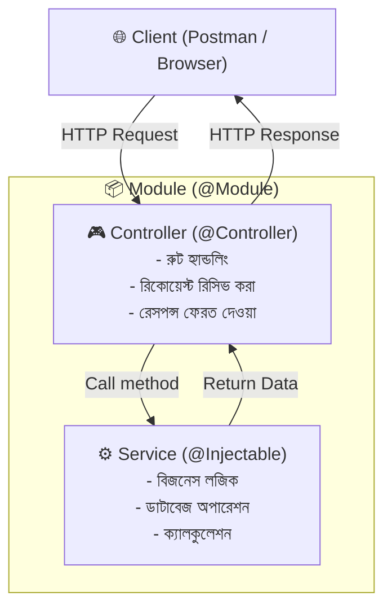

# ০১. NestJS আর্কিটেকচার: Module, Controller এবং Service (@Injectable)

NestJS একটি পূর্ণাঙ্গ এন্টারপ্রাইজ-গ্রেড ফ্রেমওয়ার্ক। এর মূল ভিত্তি দাঁড়িয়ে আছে তিনটি প্রধান উপাদানের উপর:
1. **Module (মডিউল)**
2. **Controller (কন্ট্রোলার)**
3. **Service / Provider (সার্ভিস)**

এই তিনটির পারস্পরিক সম্পর্ক ও কাজ সহজ বাংলায় নিচে ব্যাখ্যা করা হলো।

---

## ১. The Big Picture (সম্পর্কের ডায়াগ্রাম)



---

## ২. Module (`@Module`) কী এবং কেন লাগে?

NestJS অ্যাপ্লিকেশন পুরোপুরি **Modular (মডুলার)**। অর্থাৎ একটি বড় অ্যাপ্লিকেশনের বিভিন্ন ফিচারকে আলাদা আলাদা স্বয়ংসম্পূর্ণ বাক্সে ভাগ করা হয়। প্রতিটি বাক্সই হলো একটি **Module**।

যেমন আমাদের এই হেল্পডেস্কে:
- টিকিট সংক্রান্ত কাজের জন্য: `TicketsModule`
- ইউজার ও লগইনের জন্য: `AuthModule` বা `UsersModule`
- অ্যাপ্লিকেশনের প্রধান প্রবেশদ্বার: `AppModule`

### `@Module()` ডেকোরেটরের ৪টি প্রোপার্টি:

```typescript
@Module({
  imports: [],      // অন্য যেসব মডিউলের সার্ভিস বা ফিচার এই মডিউলের দরকার
  controllers: [],  // এই মডিউলের আন্ডারে কোন কোন কন্ট্রোলার থাকবে
  providers: [],    // যেসব সার্ভিস বা ক্লাস NestJS IoC কন্টেইনার দিয়ে ইনজেক্ট করতে হবে
  exports: [],      // এই মডিউলের কোন সার্ভিসটি অন্য কোনো মডিউল ব্যবহার করতে পারবে
})
export class TicketsModule {}
```

### বাস্তব উদাহরণ:
ধরে নিন `TicketsModule`-এ একটি সার্ভিস আছে যা ইউজারদের টিকিট সংখ্যা দেখায়। যদি `UsersModule`-এর সেই সার্ভিসটি দরকার হয়, তবে:
1. `TicketsModule`-এর `exports: [TicketsService]`-এ সার্ভিসটি উন্মুক্ত করতে হবে।
2. `UsersModule`-এর `imports: [TicketsModule]`-এ মডিউলটি যুক্ত করতে হবে।

---

## ৩. Controller (`@Controller`) কী এবং এর দায়িত্ব কী?

**Controller** হলো আপনার অ্যাপ্লিকেশনের **রিসেপশনিস্ট বা ট্রাফিক পুলিশ**।

### কন্ট্রোলারের মূল দায়িত্ব:
- ক্লায়েন্ট থেকে আসা HTTP Request (GET, POST, PUT, DELETE) রিসিভ করা।
- URL রুট হ্যান্ডেল করা (যেমন: `/api/tickets`, `/api/tickets/:id`)।
- ডেটা সার্ভিসকে পাঠিয়ে দেওয়া এবং সার্ভিসের কাজ শেষে ক্লায়েন্টকে রেসপন্স পাঠানো।

> ⚠️ **গুরুত্বপূর্ণ নিয়ম:** কন্ট্রোলারে কখনো বড় কোনো বিজনেস লজিক বা ডাটাবেজ ক্যালকুলেশন লিখতে নেই। কন্ট্রোলার শুধু ট্রাফিক হ্যান্ডেল করবে, বাকি কাজ সার্ভিস করবে।

### একটি আদর্শ কন্ট্রোলারের উদাহরণ:
```typescript
import { Controller, Get, Post, Body, Param, ParseIntPipe } from '@nestjs/common';
import { TicketsService } from './tickets.service.js';
import { CreateTicketDto } from './dto/create-ticket.dto.js';

@Controller('tickets') // রুট পাথ: /api/tickets
export class TicketsController {
  // Dependency Injection এর মাধ্যমে সার্ভিস নেওয়া
  constructor(private readonly ticketsService: TicketsService) {}

  @Get() // GET /api/tickets
  findAll() {
    return this.ticketsService.findAll();
  }

  @Get(':id') // GET /api/tickets/5
  findOne(@Param('id', ParseIntPipe) id: number) {
    return this.ticketsService.findOne(id);
  }

  @Post() // POST /api/tickets
  create(@Body() createTicketDto: CreateTicketDto) {
    return this.ticketsService.create(createTicketDto);
  }
}
```

---

## ৪. Service এবং `@Injectable()` কী?

**Service** হলো আপনার অ্যাপ্লিকেশনের **মূল কর্মী বা কারিগর**। সব ধরনের বিজনেস লজিক, ডাটাবেজ কুয়েরি, ক্যালকুলেশন এবং থার্ড পার্টি API কল সার্ভিসের ভেতরে লেখা হয়।

### `@Injectable()` ডেকোরেটর কী করে?
একটি সাধারণ টাইপস্ক্রিপ্ট ক্লাসের উপর যখন আপনি `@Injectable()` বসান:

```typescript
import { Injectable } from '@nestjs/common';

@Injectable()
export class TicketsService {
  private tickets = [];

  findAll() {
    return this.tickets;
  }
}
```

তখন NestJS-এর কাছে একটি সংকেত যায়:
1. **IoC কন্টেইনারে নিবন্ধন:** NestJS ফ্রেমওয়ার্ক বুঝতে পারে যে এই ক্লাসটি সাধারণ কোনো ক্লাস নয়; ফ্রেমওয়ার্ক নিজে এর অবজেক্ট (Instance) তৈরি করবে এবং মেমোরিতে সংরক্ষণ করবে।
2. **ডিপেনডেন্সি ইনজেকশন অনুমোদন:** এই ক্লাসের কনস্ট্রাক্টরে অন্য কোনো সার্ভিস ঢুকানো যাবে এবং এই সার্ভিসটিকে অন্য কোনো কন্ট্রোলারের কনস্ট্রাক্টরে ইনজেক্ট করা যাবে।

> **যদি `@Injectable()` না দেন:** NestJS ক্লাসটির মেটাডাটা রিফ্লেক্ট করতে পারবে না এবং কন্ট্রোলারে ইনজেক্ট করার সময় বলবে `Nest can't resolve dependencies of the TicketsController...`।

---

## ৫. সংক্ষেপে রিক্যাপ

| উপাদান | কীসের দায়িত্ব | অ্যানালজি |
| :--- | :--- | :--- |
| **`@Module`** | পুরো ফিচারটিকে একটি প্যাকেজে বাঁধা | অফিস ডিপার্টমেন্ট (যেমন: আইটি বিভাগ) |
| **`@Controller`** | ইনকামিং রিকোয়েস্ট রিসিভ করা ও রাউট করা | রিসেপশনিস্ট (যিনি কাস্টমারের আবেদন গ্রহণ করেন) |
| **`@Injectable` (Service)** | মূল কাজ বা লজিক সম্পাদন করা | পেছনের কারিগর বা টেকনিশিয়ান (যিনি মূল কাজ সম্পন্ন করেন) |

---
⬅️ [Master Index এ ফিরে যান](./README.md) | ➡️ [পরবর্তী গাইড: Decorators এবং Dynamic Modules](./02-decorators-and-dynamic-modules.md)
