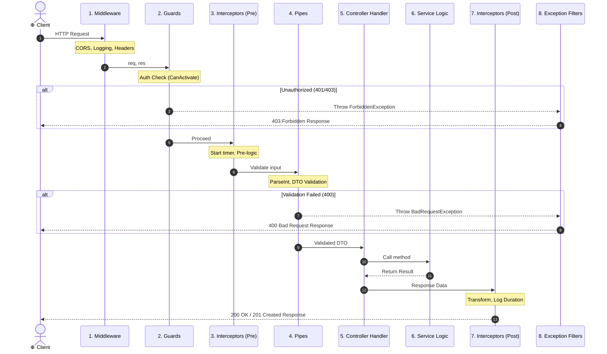

# ০৩. NestJS রিকোয়েস্ট লাইফসাইকেল (Request Lifecycle Overview)

NestJS অ্যাপ্লিকেশনে একটি ক্লায়েন্ট রিকোয়েস্ট আসার পর থেকে রেসপন্স ফেরত যাওয়া পর্যন্ত ঠিক কী কী ধাপ পার হয়, তা বোঝা একজন প্রফেশনাল ব্যাকএন্ড ডেভেলপারের জন্য সবচেয়ে জরুরি বিষয়।

---

## ১. বাস্তব জীবনের উপমা (Airport Security Analogy)

ধরে নিন আপনি একটি আন্তর্জাতিক বিমানে চড়তে যাচ্ছেন:

1. **Airport Main Gate (Middleware):** সিকিউরিটি চেক করে আপনি বৈধ দর্শনার্থী কি না, অথবা লগ রাখে আপনি কয়টায় বিমানবন্দরে ঢুকলেন।
2. **Passport / Visa Officer (Guards):** আপনার পাসপোর্ট ও ভিসা বৈধ কি না (Authentication & Authorization)। ভিসা না থাকলে এয়ারপোর্টের ভেতরে ঢোকার অনুমতিই নেই!
3. **VIP Protocol Officer (Interceptors - Before):** আপনার প্রবেশের সময় রেকর্ড রাখে এবং বিশেষ কোনো প্রোটোকল থাকলে প্রস্তুত করে।
4. **Baggage Scanner (Pipes):** আপনার ব্যাগে কোনো নিষিদ্ধ জিনিস আছে কি না (Validation), এবং লাগেজ ওজন করে সঠিক ফরম্যাটে কনভার্ট করে (Transformation)।
5. **Flight Captain (Controller & Service):** মূল যাত্রা শুরু হলো। সার্ভিস আপনার গন্তব্যে বিমান চালিয়ে নিয়ে যায়।
6. **Customs Exit Check (Interceptors - After):** বিমান ল্যান্ড করার পর আপনি বের হওয়ার সময় মোট কতক্ষণ লাগলো তা পরিমাপ করে এবং রেসপন্স প্যাকেট রেডি করে।
7. **Emergency Team (Exception Filters):** যাত্রার মাঝে কোনো দুর্ঘটনা বা ক্র্যাশ ঘটলে ইমার্জেন্সি টিম উদ্ধার করে একটি ভদ্র নোটিশ দেয়।

---

## ২. নিখুঁত এক্সিকিউশন সিকোয়েন্স (The Exact Order of Execution)

NestJS রিকোয়েস্ট হ্যান্ডেল করার সময় কঠোরভাবে নিচের ক্রম অনুসরণ করে:

---

## ৩. কেন এই নির্দিষ্ট ক্রমটি এত নিখুঁত?

### ১) কেন Pipes-এর আগে Guards চলে?
- চিন্তা করুন, যদি ইউজার লগইন না-ই করে থাকে, তবে তার পাঠানো হাজার লাইনের বিশাল JSON বডি ভ্যালিডেশন করে সার্ভারের CPU অপচয় করার কোনো মানে হয় না।
- তাই NestJS আগে **Guard** দিয়ে নিশ্চিত করে ইউজার অথেনটিকেটেড কি না। তারপর **Pipe** দিয়ে ডেটা যাচাই করে।

### ২) কেন Middleware-এর পরে Guards চলে?
- মিডলওয়্যার চলে একদম শুরুতে (Express ইঞ্জিন লেভেলে)। মিডলওয়্যারে সেশন কুকি পার্স করা বা JWT টোকেন ডিকোড করার কাজ সম্পন্ন হয়।
- এরপর গার্ড এসে সেই ডিকোড করা ইউজারের রোল বা পারমিশন নিখুঁতভাবে চেক করতে পারে।

### ৩) Interceptors কেন দুইবার চলে (Before ও After)?
- ইন্টারসেপ্টর রিকোয়েস্টের শুরুতে কন্ট্রোলারের আগে ঢুকতে পারে, আবার কন্ট্রোলারের মেথড রিটার্ন করার পর বের হওয়ার সময় ডেটাকে মডিফাই করতে পারে। 
- এর ফলে যেকোনো রিকোয়েস্টে **কত মিলি-সেকেন্ড সময় লাগলো** তা নিখুঁতভাবে মাপা যায়।

---

## ৪. সংক্ষেপে দ্রুত টেবিল

| ধাপ | উপাদান | কাজ | কখন থামিয়ে দেয়? |
| :---: | :--- | :--- | :--- |
| **১** | **Middleware** | রিকোয়েস্ট লগিং, CORS, বডি পার্সিং | রিকোয়েস্ট অবৈধ হলে `res.status(400).send()` |
| **২** | **Guards** | অথেন্টিকেশন ও রোল পারমিশন চেক | `false` রিটার্ন করলে বা এরর ছুঁড়লে (401/403) |
| **৩** | **Interceptors (Pre)** | টাইমস্ট্যাম্প শুরু, ক্যাশ চেক | ক্যাশে ডেটা থাকলে সরাসরি রেসপন্স ফেরত পাঠায় |
| **৪** | **Pipes** | DTO ভ্যালিডেশন ও টাইপ কনভার্সন | ভ্যালিডেশন ফেইল হলে (400 Bad Request) |
| **৫** | **Controller/Service** | বিজনেস লজিক এবং ডাটাবেজ অপারেশন | কোডে কোনো বাগ বা এরর ঘটলে |
| **৬** | **Interceptors (Post)** | রেসপন্স ডেটা র‍্যাপ করা, লগিং শেষ | ডেটা ম্যানিপুলেট করতে পারে |
| **৭** | **Exception Filters** | এরর ধরলে ইউজার-ফ্রেন্ডলি JSON দেওয়া | সেন্ট্রালাইজড এরর রেসপন্স জেনারেট করে |

---
⬅️ [পূর্ববর্তী গাইড: Decorators ও Dynamic Modules](./02-decorators-and-dynamic-modules.md) | ➡️ [পরবর্তী গাইড: Middleware এবং Guards](./04-middleware-and-guards.md)
