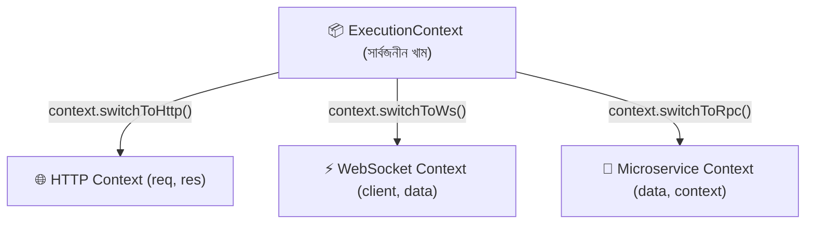

# ০৫. ExecutionContext এবং CallHandler এর গভীর বিশ্লেষণ

আপনি যখন NestJS-এ কোনো **Guard** বা **Interceptor** লিখতে যাবেন, তখনই প্যারামিটারে দুটি জিনিস দেখতে পাবেন:
1. `context: ExecutionContext`
2. `next: CallHandler`

বেশিরভাগ নতুন ডেভেলপার এগুলো না বুঝে মুখস্থ কোড লিখেন। এই গাইডে এর পেছনের আকর্ষণীয় ইঞ্জিনিয়ারিং খুব সহজে ব্যাখ্যা করা হয়েছে।

---

## ১. ExecutionContext কী এবং কেন এটি সাধারণ `(req, res)` নয়?

### সমস্যা: Express.js-এর সীমাবদ্ধতা
Express.js-এ সবকিছু ছিল `(req, res, next)`। কিন্তু সমস্যা হলো:
- আপনি যদি একটি চ্যাট অ্যাপ্লিকেশন বানান যা **WebSocket** দিয়ে চলে, সেখানে কোনো `req` বা `res` থাকে না; সেখানে থাকে `client` এবং `data`।
- আপনি যদি **Microservices** (যেমন: RabbitMQ, Kafka বা gRPC) দিয়ে কাজ করেন, সেখানে কোনো HTTP রিকোয়েস্টই থাকে না; সেখানে থাকে মেসেজ ও প্যাকেট।

### NestJS-এর ম্যাজিক সমাধান: `ExecutionContext`
NestJS হলো **মাল্টি-প্রোটোকল (Multi-protocol)** ফ্রেমওয়ার্ক। অর্থাৎ আপনার একই বিজনেস লজিক HTTP রিকোয়েস্টেও চলতে পারে, আবার WebSocket বা Kafka মেসেজেও চলতে পারে।

তাই NestJS সরাসরি `(req, res)` না দিয়ে একটি ইউনিভার্সাল খাম বা **`ExecutionContext`** দেয়।



---

## ২. `ExecutionContext`-এর প্রধান মেথডসমূহ

### ১) `context.switchToHttp()`
যখন আপনি একটি সাধারণ ওয়েব API বানাচ্ছেন, তখন সার্বজনীন কনটেক্সট থেকে HTTP কনটেক্সটে সুইচ করতে হয়:
```typescript
const httpContext = context.switchToHttp();

const request = httpContext.getRequest<Request>();   // Express Request
const response = httpContext.getResponse<Response>(); // Express Response
```

### ২) `context.getClass()`
বর্তমানে কোন **Controller** ক্লাসটি এক্সিকিউট হচ্ছে তা সরাসরি জানতে পারবেন:
```typescript
console.log(context.getClass().name); // আউটপুট: "TicketsController"
```

### ৩) `context.getHandler()`
বর্তমানে কন্ট্রোলারের কোন **মেথড বা ফাংশনটি** রান হচ্ছে তা রেফারেন্স আকারে দেয়:
```typescript
console.log(context.getHandler().name); // আউটপুট: "findAll"
```
> 💡 **কেন এটি দরকার?** এর মাধ্যমেই রিফ্লেক্টর (Reflector) বুঝতে পারে যে এই নির্দিষ্ট মেথডের উপর কোনো কাস্টম ডেকোরেটর (যেমন: `@Roles('ADMIN')`) লাগানো আছে কি না!

---

## ৩. CallHandler এবং `next.handle()` কী?

`CallHandler` ইন্টারফেসটি শুধুমাত্র **Interceptor**-এ পাওয়া যায়।

```typescript
@Injectable()
export class MyInterceptor implements NestInterceptor {
  intercept(context: ExecutionContext, next: CallHandler): Observable<any> {
    console.log('১. কন্ট্রোলারে ঢোকার আগে...');

    return next.handle(); // ⬅️ এটিই হলো ম্যাজিক সুইচ!
  }
}
```

### `next.handle()` কী করে?
- এটি একটি সুইচ বা ট্র্রিগারের মতো। যতক্ষণ পর্যন্ত আপনি `next.handle()` কল না করবেন, ততক্ষণ পর্যন্ত NestJS কন্ট্রোলারের মেথড এক্সিকিউট করবে না!
- `next.handle()` কল করলে এটি রিকোয়েস্টটিকে কন্ট্রোলারে পাঠিয়ে দেয় এবং কন্ট্রোলারের রিটার্ন করা ডেটাকে একটি **RxJS Observable** স্ট্রিম আকারে ফেরত নিয়ে আসে।

### কেন RxJS Observable ব্যবহার করা হয়েছে?
কারণ Observable ব্যবহার করার ফলে আপনি খুব সহজে RxJS-এর শক্তিশালী অপারেটরগুলো (যেমন: `tap()`, `map()`, `catchError()`, `timeout()`) ব্যবহার করতে পারেন:

```typescript
import { tap, map } from 'rxjs/operators';

return next.handle().pipe(
  // ১. রেসপন্স ডাটা পরিবর্তন করা
  map(data => ({
    success: true,
    data: data, // মূল ডেটাকে একটি র‍্যাপারে মুড়ে দেওয়া
  })),

  // ২. সাইড-ইফেক্ট বা লগিং করা
  tap(() => console.log('২. কন্ট্রোলার থেকে রেসপন্স রেডি হয়ে বের হয়ে গেছে!'))
);
```

---

## ৪. সংক্ষেপে রিক্যাপ

1. **`ExecutionContext`**: একটি ইউনিভার্সাল অবজেক্ট যা বর্তমান রিকোয়েস্টের পূর্ণাঙ্গ তথ্য (প্রোটোকল, কন্ট্রোলার ক্লাস এবং মেথড হ্যান্ডলার) বহন করে।
2. **`switchToHttp()`**: универсаল অবজেক্ট থেকে `req` এবং `res` পাওয়ার চাবিকাঠি।
3. **`CallHandler` (`next.handle()`):** কন্ট্রোলারের মেথড কল করার এবং রেসপন্স স্ট্রিম পাওয়ার মাধ্যম।

---
⬅️ [পূর্ববর্তী গাইড: Middleware ও Guards](./04-middleware-and-guards.md) | ➡️ [পরবর্তী গাইড: Interceptors এবং Logging](./06-interceptors-and-logging.md)
