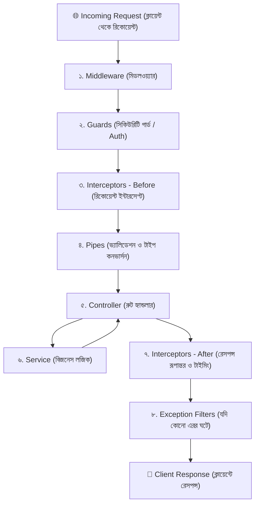

# NestJS কোর কনসেপ্ট বাংলা গাইড সিরিজ (Master Index)

NestJS-এর কোর কনসেপ্টগুলো নতুনদের কাছে অনেক সময় জটিল মনে হতে পারে। প্রতিটি বিষয় যেন খুব সহজে বাস্তব জীবনের উপমা ও স্টেপ-বাই-স্টেপ কোড উদাহরণের মাধ্যমে বোঝা যায়, সেজন্য এই সিরিজটি আলাদা আলাদা গাইডে সাজানো হয়েছে।

---

## 🗺️ সম্পূর্ণ রিকোয়েস্ট লাইফসাইকেল (The Big Picture)

যখন একজন ক্লায়েন্ট আপনার NestJS সার্ভারে একটি রিকোয়েস্ট পাঠায়, তখন সেটি নিচের ধারাবাহিক পথ অতিক্রম করে:

---

## 📚 গাইড ভিত্তিক সূচিপত্র

প্রতিটি বিষয়ের বিস্তারিত পড়ার জন্য নিচের লিংকে ক্লিক করুন:

| গাইড ফাইল | বিষয়বস্তু (Topics Covered) |
| :--- | :--- |
| **[০১. আর্কিটেকচার: Module, Controller & Service](./01-architecture-module-controller-service.md)** | `@Module()`, `@Controller()`, `@Injectable()`, Services এবং IoC Container কীভাবে একসাথে কাজ করে। |
| **[০২. Decorators এবং Dynamic Modules (forRoot)](./02-decorators-and-dynamic-modules.md)** | Decorator কী ও কীভাবে মেটাডাটা রাখে, `forRoot()`, `forFeature()` ও `forRootAsync()` এর পূর্ণাঙ্গ ব্যাখ্যা। |
| **[০৩. রিকোয়েস্ট লাইফসাইকেল (Request Lifecycle)](./03-request-lifecycle-overview.md)** | রিকোয়েস্ট সার্ভারে ঢুকলে কোন সিকোয়েন্সে কোনটা এক্সিকিউট হয় এবং কেন এই ক্রম রাখা হয়েছে। |
| **[০৪. Middleware এবং Guards](./04-middleware-and-guards.md)** | Express-স্টাইল `Middleware` বনাম NestJS `Guards` (`CanActivate`) এর পার্থক্য ও প্র্যাকটিক্যাল ব্যবহার। |
| **[০৫. ExecutionContext এবং CallHandler](./05-execution-context-and-call-handler.md)** | `ExecutionContext` কী, `switchToHttp()` কেন লাগে, এবং `CallHandler` ও `next.handle()` এর ভেতরের রহস্য। |
| **[০৬. Interceptors এবং Logging](./06-interceptors-and-logging.md)** | রিকোয়েস্ট/রেসপন্স ট্রান্সফর্মেশন, এক্সিকিউশন টাইম মাপা, এবং NestJS Built-in `Logger` এর বাস্তব উদাহরণ। |
| **[০৭. Pipes এবং Exception Filters](./07-pipes-and-exception-filters.md)** | `PipeTransform` (ভ্যালিডেশন ও রূপান্তর) এবং `ExceptionFilter` (কাস্টম সেন্ট্রালাইজড এরর হ্যান্ডলিং)। |
| **[⭐ DI ও @Injectable() বিগিনার ডিপ-ডাইভ](./dependency-injection-deep-dive.md)** | একদম নতুনদের জন্য গাড়ি ও ইঞ্জিনের উপমাসহ Dependency Injection এবং `@Injectable()`-এর চুলচেরা বিশ্লেষণ। |

---

## 📌 অন্যান্য প্রয়োজনীয় গাইডসমূহ (পূর্ববর্তী ডকুমেন্টস):
- **[Dependency Injection & Constructor গাইড](../di-and-constructor-guide.md)**
- **[DTO, class-validator & class-transformer গাইড](../dto-validation-guide.md)**
- **[Date, toISOString() & String মেথডস গাইড](../date-and-string-methods-guide.md)**
