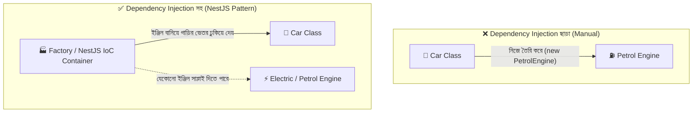
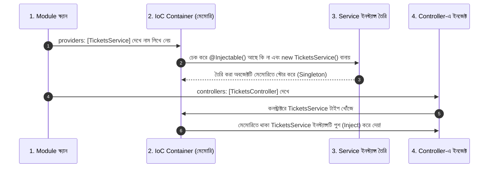

# Dependency Injection (DI) এবং `@Injectable()`: একদম শুরু থেকে সহজ বাংলা গাইড

আপনি যদি এখনো **Dependency Injection (DI)** এবং **`@Injectable()`** নিয়ে বিভ্রান্ত থাকেন, তবে একদম চিন্তা করবেন না। বেশিরভাগ নতুন প্রোগ্রামারদের এই কনসেপ্টটি বুঝতে সময় লাগে। 

এই গাইডে কোনো জটিল টেকনিক্যাল শব্দ ছাড়া বাস্তব জীবনের সহজ উদাহরণ দিয়ে ধাপে ধাপে সবকিছু পরিষ্কার করা হয়েছে।

---

## 📑 সূচিপত্র
1. [Dependency এবং Injection শব্দের অর্থ কী?](#১-dependency-এবং-injection-শব্দের-অর্থ-কী)
2. [বাস্তব জীবনের চোখ খুলে দেওয়া উদাহরণ (কার ও ইঞ্জিন)](#২-বাস্তব-জীবনের-চোখ-খুলে-দেওয়া-উদাহরণ-কার-ও-ইঞ্জিন)
3. [কোডের মাধ্যমে বাস্তব সমস্যা ও সমাধান](#৩-কোডের-মাধ্যমে-বাস্তব-সমস্যা-ও-সমাধান)
   - [ক) DI ছাড়া কোড (ভুল বা কষ্টদায়ক উপায়)](#ক-di-ছাড়া-কোড-ভুল-বা-কষ্টদায়ক-উপায়)
   - [খ) DI সহ কোড (NestJS-এর জাদুকরী উপায়)](#খ-di-সহ-কোড-nestjs-এর-জাদুকরী-উপায়)
4. [`@Injectable()` ডেকোরেটর আসলে কী কাজ করে?](#৪-injectable-ডেকোরেটর-আসলে-কী-কাজ-করে)
   - [কন্ট্রোলারে কেন `@Injectable()` দিতে হয় না?](#কন্ট্রোলারে-কেন-injectable-দিতে-হয়-না)
   - [`@Injectable()` ভুলে না দিলে কী সমস্যা হবে?](#injectable-ভুলে-না-দিলে-কী-সমস্যা-হবে)
5. [NestJS IoC Container পর্দার পেছনে কীভাবে কাজ করে? (৪টি ধাপ)](#৫-nestjs-ioc-container-পর্দার-পেছনে-কীভাবে-কাজ-করে-৪টি-ধাপ)
6. [কখন এবং কীভাবে DI ব্যবহার করবেন? (Use Cases)](#৬-কখন-এবং-কীভাবে-di-ব্যবহার-করবেন-use-cases)
7. [এক নজরে সারসংক্ষেপ (Cheat Sheet)](#৭-এক-নজরে-সারসংক্ষেপ-cheat-sheet)

---

## ১. Dependency এবং Injection শব্দের অর্থ কী?

ভেঙে ভেঙে শব্দ দুটি বুঝি:

### ১) Dependency (ডিপেনডেন্সি বা নির্ভরতা):
- সহজ কথায়: **"আমার কাজ করার জন্য আমার যে জিনিসটি দরকার, সেটাই আমার ডিপেনডেন্সি।"**
- উদাহরণ: 
  - আপনার বেঁচে থাকার জন্য **অক্সিজেন** দরকার। তাই অক্সিজেন হলো আপনার ডিপেনডেন্সি।
  - একটি কন্ট্রোলারের টিকিট ডেটা খোঁজার জন্য **সার্ভিস** দরকার। তাই সার্ভিস হলো কন্ট্রোলারের ডিপেনডেন্সি।

### ২) Injection (ইনজেকশন বা পুশ করা):
- সহজ কথায়: **"যে জিনিসটি আমার দরকার, তা আমি নিজে তৈরি না করে বাহির থেকে কেউ যদি আমার হাতে তুলে দেয়, সেটাই হলো ইনজেকশন।"**
- মেডিকেল ইনজেকশনের কথা চিন্তা করুন: শরীরে ভিটামিনের ঘাটতি হলে ডাক্তার বাহির থেকে সিরিঞ্জ দিয়ে ভিটামিন শরীরে পুশ (Inject) করে দেন।

> 💡 **সংজ্ঞা:** যখন একটি ক্লাসের প্রয়োজনীয় অন্য কোনো ক্লাস বা অবজেক্ট নিজে `new` দিয়ে তৈরি না করে, বাহির থেকে কোনো ফ্রেমওয়ার্ক (NestJS) তার ভেতরে সাপ্লাই দেয়, তাকেই বলে **Dependency Injection (DI)**।

---

## ২. বাস্তব জীবনের চোখ খুলে দেওয়া উদাহরণ (কার ও ইঞ্জিন)

ধরে নিন আপনি একটি **গাড়ি (Car)** বানাবেন। গাড়ির চলার জন্য একটি **ইঞ্জিন (Engine)** দরকার।



### পদ্ধতি ১: DI ছাড়া (নিজে `new` করা)
গাড়ির ক্লাসের ভেতরে গিয়ে আপনি সরাসরি লিখলেন:
```typescript
class Car {
  private engine = new PetrolEngine(); // গাড়ি নিজেই পেট্রোল ইঞ্জিন বানাচ্ছে!
}
```
**সমস্যা কী?**
১ বছর পর কোম্পানি সিদ্ধান্ত নিলো পেট্রোল নয়, গাড়িটি **ইলেকট্রিক (Electric)** ইঞ্জিনে চলবে।
এখন আপনাকে গাড়ির কোড ভেঙে নতুন করে `new ElectricEngine()` লিখতে হবে। গাড়িটি ইঞ্জিনের সাথে শক্তভাবে আটকে গেছে (Tight Coupling)।

### পদ্ধতি ২: DI সহ (বাইরে থেকে ইঞ্জিন গ্রহণ করা)
গাড়ি শুধু বলবে: *"আমাকে শুধু যেকোনো একটি ইঞ্জিন এনে দাও, আমি চালাবো।"*
```typescript
class Car {
  // কনস্ট্রাক্টরে বাইরে থেকে ইঞ্জিন নিচ্ছে
  constructor(private engine: Engine) {}
}
```
এখন গাড়ি তৈরির কারিগর (NestJS) চাইলে পেট্রোল ইঞ্জিনও ঢুকিয়ে দিতে পারে, আবার ইচ্ছা হলে ইলেকট্রিক ইঞ্জিনও ঢুকিয়ে দিতে পারে। গাড়ির ভেতরের এক লাইন কোডও পরিবর্তন করতে হবে না!

---

## ৩. কোডের মাধ্যমে বাস্তব সমস্যা ও সমাধান

আমাদের হেল্পডেস্ক অ্যাপের উদাহরণ দিয়ে দেখা যাক:

### ক) DI ছাড়া কোড (ভুল বা কষ্টদায়ক উপায়)

```typescript
// tickets.controller.ts
@Controller('tickets')
export class TicketsController {
  // ❌ কন্ট্রোলার নিজেই সার্ভিস তৈরি করছে
  private ticketsService = new TicketsService();

  @Get()
  getTickets() {
    return this.ticketsService.findAll();
  }
}
```

#### এতে কী কী ভয়াবহ সমস্যা হয়?
1. কালকে যদি `TicketsService`-এর ভেতরে ডাটাবেজ কানেকশন বা লগার লাগে:
   ```typescript
   export class TicketsService {
     constructor(private db: Database, private logger: Logger) {}
   }
   ```
   তাহলে কন্ট্রোলারের কোড ভেঙে যাবে! কন্ট্রোলারের ভেতর তখন লিখতে হবে:
   `new TicketsService(new Database(), new Logger())`। অর্থাৎ কন্ট্রোলারকে পুরো দুনিয়ার সব সার্ভিস নিজে তৈরি করা শিখতে হবে!
2. আপনি যখন ইউনিট টেস্ট করবেন, আসল ডাটাবেজ ছাড়া কোনো ডামি বা মক সার্ভিস টেস্ট করতে পারবেন না।

---

### খ) DI সহ কোড (NestJS-এর জাদুকরী উপায়)

```typescript
// tickets.controller.ts
@Controller('tickets')
export class TicketsController {
  // ✅ কন্ট্রোলার শুধু বলে দিলো: "আমার TicketsService লাগবে"
  constructor(private readonly ticketsService: TicketsService) {}

  @Get()
  getTickets() {
    return this.ticketsService.findAll();
  }
}
```

এখানে কন্ট্রোলার জানেই না `TicketsService` কীভাবে তৈরি হয়। NestJS নিজে সবকিছু তৈরি করে কন্ট্রোলারের হাতে তুলে দেয়!

---

## ৪. `@Injectable()` ডেকোরেটর আসলে কী কাজ করে?

সার্ভিস ক্লাসের মাথার উপর আমরা লিখি:
```typescript
import { Injectable } from '@nestjs/common';

@Injectable()
export class TicketsService {
  // ...
}
```

### এর মূল কাজ কী?
TypeScript যখন কোড কম্পাইল করে JavaScript বানায়, তখন সে ক্লাসের কনস্ট্রাক্টরের টাইপ সংক্রান্ত তথ্যগুলো মুছে ফেলে (Type Erasure)। 

কিন্তু ক্লাসের মাথায় যখন **`@Injectable()`** লাগানো থাকে:
1. **মেটাডাটা সেভ রাখা:** এটি TypeScript এবং `reflect-metadata`-কে আদেশ দেয়: *"এই ক্লাসের কনস্ট্রাক্টরে কী কী প্যারামিটার আছে তার তথ্য মেমোরিতে সংরক্ষণ করে রাখো।"*
2. **IoC Container-এ লাইসেন্স দেওয়া:** এটি NestJS-কে বলে: *"আমি একটি সার্ভিস, আমাকে অন্যের কনস্ট্রাক্টরে ইনজেক্ট করার অনুমতি দেওয়া হলো।"*

---

### কন্ট্রোলারে কেন `@Injectable()` দিতে হয় না?
আপনার মনে প্রশ্ন জাগতে পারে: *কন্ট্রোলারের মাথায় তো শুধু `@Controller()` লিখি, `@Injectable()` লিখি না কেন?*

**উত্তর:**
NestJS-এর সোর্স কোডে `@Controller()` ডেকোরেটরের ভেতরেই আগে থেকেই `@Injectable()` ঢুকিয়ে দেওয়া আছে! তাই কন্ট্রোলারে আলাদা করে লেখার প্রয়োজন হয় না। কিন্তু সার্ভিস যেহেতু সাধারণ ক্লাস, তাই তার মাথায় স্পষ্ট করে `@Injectable()` লিখতে হয়।

---

### `@Injectable()` ভুলে না দিলে কী সমস্যা হবে?
যদি কোনো সার্ভিসে ডিপেনডেন্সি থাকে (যেমন: `constructor(private db: DatabaseService)`) কিন্তু আপনি ক্লাসের মাথায় `@Injectable()` দেননি, তখন NestJS সার্ভার স্টার্ট হওয়ার সময় চরম ক্ষিপ্ত হয়ে এই বিখ্যাত এরর দেবে:

```bash
Nest can't resolve dependencies of the TicketsService (?). 
Please make sure that the argument "DatabaseService" at index [0] is available in the TicketsModule context.
Potential solutions:
- If DatabaseService is a provider, is it part of the current TicketsModule?
- If DatabaseService is exported from a separate @Module, is that module imported within TicketsModule?
```

কারণ `@Injectable()` না থাকায় NestJS কনস্ট্রাক্টরের ডিপেনডেন্সি স্ক্যান করতে পারেনি!

---

## ৫. NestJS IoC Container পর্দার পেছনে কীভাবে কাজ করে? (৪টি ধাপ)

যখন আপনি টার্মিনালে `npm run start:dev` কমান্ড দেন, তখন NestJS নিচের ৪টি ধাপে ডিপেনডেন্সি ইনজেক্ট করে:



1. **রেজিস্ট্রেশন:** মডিউলের `providers: [TicketsService]` দেখে NestJS বুঝতে পারে এই সার্ভিসটিকে ম্যানেজ করতে হবে।
2. **মেটাডাটা যাচাই:** `@Injectable()` দেখে NestJS সার্ভিসের সমস্ত ডিপেনডেন্সি আগে তৈরি করে নেয়।
3. **অবজেক্ট তৈরি (Instantiation):** NestJS একবার `new TicketsService()` তৈরি করে নিজের কাছে রেখে দেয়।
4. **হাতে তুলে দেওয়া (Injection):** যখন কন্ট্রোলার তৈরি হয়, তখন স্বয়ংক্রিয়ভাবে তার কনস্ট্রাক্টরে সেই সার্ভিসটি পাস করে দেয়।

---

## ৬. কখন এবং কীভাবে DI ব্যবহার করবেন? (Use Cases)

### কখন ব্যবহার করবেন?
- ✅ যখনই একটি ক্লাসের অন্য কোনো সার্ভিস, ডাটাবেজ রিপোজিটরি, লগার, কনফিগ বা থার্ড-পার্টি লাইব্রেরি প্রয়োজন হবে।
- ✅ Controller যখন Service ব্যবহার করবে।
- ✅ Service যখন অন্য কোনো Service ব্যবহার করবে (যেমন: `TicketsService`-এর ভেতর `EmailService` বা `Logger` লাগবে)।

### ব্যবহারের ৩টি সহজ নিয়ম (The 3-Step Recipe):

#### ধাপ ১: সার্ভিসের মাথায় `@Injectable()` দিন
```typescript
// src/tickets/tickets.service.ts
@Injectable()
export class TicketsService {
  findAll() { return ['Ticket 1', 'Ticket 2']; }
}
```

#### ধাপ ২: মডিউলে `providers`-এর তালিকায় রাখুন
```typescript
// src/tickets/tickets.module.ts
@Module({
  controllers: [TicketsController],
  providers: [TicketsService], // ⬅️ এখানে রেজিস্ট্রেশন করতে হবে
})
export class TicketsModule {}
```

#### ধাপ ৩: যে ক্লাসে ব্যবহার করবেন তার `constructor`-এ লিখে দিন
```typescript
// src/tickets/tickets.controller.ts
@Controller('tickets')
export class TicketsController {
  constructor(private readonly ticketsService: TicketsService) {} // ⬅️ NestJS স্বয়ংক্রিয়ভাবে ইনজেক্ট করবে
}
```

---

## ৭. এক নজরে সারসংক্ষেপ (Cheat Sheet)

| কনসেপ্ট | সহজ বাংলা অর্থ | কেন ব্যবহার করবেন? |
| :--- | :--- | :--- |
| **Dependency** | অন্যের উপর নির্ভরশীলতা | একা একা সব কাজ না করে স্পেশালাইজড সার্ভিস ব্যবহার করতে |
| **Injection** | বাহির থেকে প্রয়োজনীয় জিনিস সরবরাহ করা | ক্লাসের ভেতরে হার্ডকোডেড `new Class()` পরিহার করতে |
| **`@Injectable()`** | ক্লাসের মাথায় দেওয়া অনুমতি স্ট্যাম্প | NestJS যেন ক্লাসের কনস্ট্রাক্টর মেটাডাটা পড়তে ও ইনজেক্ট করতে পারে |
| **IoC Container** | NestJS-এর সেন্ট্রাল কারখানা ও গুদামঘর | সব সার্ভিস নিজে তৈরি করে মেমোরিতে রাখা এবং যার যার দরকার তার কাছে পৌঁছে দেওয়া |
| **Loose Coupling** | আলগা ও স্বাধীন বাঁধন | একটি ক্লাসের কোড পরিবর্তন করলে যেন পুরো প্রজেক্ট ভেঙে না পড়ে |

---
⬅️ [Master Index এ ফিরে যান](./README.md) | 🏠 [সকল গাইড তালিকা](../)
