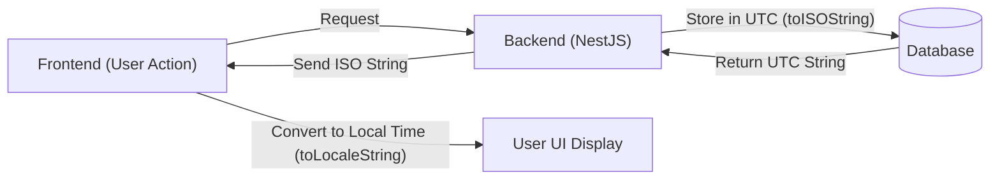

# JavaScript/TypeScript-এ Date এবং String মেথডের সহজ বাংলা গাইড

জাভাস্ক্রিপ্ট এবং টাইপস্ক্রিপ্টে তারিখ (Date) ও টেক্সট (String) নিয়ে কাজ করার সময় অনেকেই `toISOString()`, `toString()`, `toLocaleString()` নিয়ে বিভ্রান্তিতে পড়েন। 

এই গাইডে বাস্তব উদাহরণ দিয়ে ধাপে ধাপে বোঝানো হয়েছে:
- Date অবজেক্ট আসলে কী?
- কেন Date-কে String-এ কনভার্ট করতে হয়?
- কোন মেথড কখন, কেন এবং কীভাবে ব্যবহার করবেন?
- Backend (NestJS) ও Frontend-এ টাইমজোন (Timezone) কীভাবে হ্যান্ডেল করবেন?

---

## 📑 সূচিপত্র
1. [Date অবজেক্টের মূল রহস্য (Date আসলে কী?)](#১-date-অবজেক্টের-মূল-রহস্য-date-আসলে-কী)
2. [কেন Date-কে String বানাতে হয়?](#২-কেন-date-কে-string-বানাতে-হয়)
3. [সবগুলো Date মেথডের সহজ ব্যাখ্যা](#৩-সবগুলো-date-মেথডের-সহজ-ব্যাখ্যা)
   - [ক) toISOString() — ব্যাকএন্ড ও এপিআই-এর রাজা](#ক-toisostring--ব্যাকএন্ড-ও-এপিআই-এর-রাজা)
   - [খ) toString() — ডিবাগ ও কনসোল লগ](#খ-tostring--ডিবাগ-ও-কনসোল-লগ)
   - [গ) toLocaleDateString() ও toLocaleString() — ইউজার ইন্টারফেস (UI)](#গ-tolocaledatestring-ও-tolocalestring--ইউজার-ইন্টারফেস-ui)
   - [ঘ) toDateString() এবং toTimeString()](#ঘ-todatestring-এবং-totimestring)
   - [ঙ) getTime() বা Date.now() — গাণিতিক হিসাব ও তুলনা](#ঙ-gettime-বা-datenow--গাণিতিক-হিসাব-ও-তুলনা)
4. [টাইমজোন সমস্যা ও সোনার নিয়ম (Golden Rule)](#৪-টাইমজোন-সমস্যা-ও-সোনার-নিয়ম-golden-rule)
5. [NestJS হেল্পডেস্কে বাস্তব ব্যবহার (Real Project Example)](#৫-nestjs-হেল্পডেস্কে-বাস্তব-ব্যবহার-real-project-example)
6. [তুলনামূলক দ্রুত রেফারেন্স টেবিল (Cheat Sheet)](#৬-তুলনামূলক-দ্রুত-রেফারেন্স-টেবিল-cheat-sheet)

---

## ১. Date অবজেক্টের মূল রহস্য (Date আসলে কী?)

যখন আপনি জাভাস্ক্রিপ্টে লিখেন:
```typescript
const now = new Date();
```
তখন কম্পিউটার কিন্তু কোনো টেক্সট বা সুন্দর ক্যালেন্ডার মনে রাখে না। 

কম্পিউটার শুধু মনে রাখে **একটি সংখ্যা**—যেটি হলো **১ জানুয়ারি ১৯৭০ UTC রাত ১২:০০:০০** থেকে শুরু করে এখন পর্যন্ত কত **মিলি-সেকেন্ড** পার হয়েছে (যাকে বলা হয় *Unix Epoch Timestamp*)।

যেমন:
- সংখ্যাটি হতে পারে `1726671710000` (একটি সাধারণ পূর্ণসংখ্যা)।
- কিন্তু এই সংখ্যাটি তো মানুষের পক্ষে পড়ে বোঝা সম্ভব না!
- তাই এই সংখ্যাটিকে মানুষের পড়ার উপযোগী টেক্সট (String) বানানোর জন্য বিভিন্ন মেথড রয়েছে।

---

## ২. কেন Date-কে String বানাতে হয়?

### JSON-এর কোনো নিজস্ব Date টাইপ নেই!
আমরা যখন NestJS ব্যাকএন্ড থেকে ফ্রন্টএন্ডে ডেটা পাঠাই, তখন তা **JSON** ফরম্যাটে পাঠাই:
```json
{
  "id": 1,
  "title": "Login Issue",
  "createdAt": "???"
}
```
JSON শুধুমাত্র `string`, `number`, `boolean`, `array`, `object` এবং `null` সাপোর্ট করে। **JSON-এ কোনো `Date` ডেটা-টাইপ নেই!**

তাই নেটওয়ার্ক দিয়ে তারিখ পাঠাতে হলে বা ডাটাবেজে রাখতে হলে আমাদের অবশ্যই Date অবজেক্টটিকে একটি টেক্সট বা **String**-এ রূপান্তর করতে হয়।

---

## ৩. সবগুলো Date মেথডের সহজ ব্যাখ্যা

ধরে নিন আমাদের লোকাল সময় হলো **১৮ সেপ্টেম্বর, ২০২৬, রাত ৯:০১:৫০ (বাংলাদেশ সময় GMT+6)**।

```typescript
const now = new Date();
```

এখন দেখা যাক কোন মেথড কী আউটপুট দেয়:

---

### ক) `toISOString()` — ব্যাকএন্ড ও এপিআই-এর রাজা ⭐⭐⭐

এটি পুরো বিশ্বের সবচেয়ে জনপ্রিয় ও আন্তর্জাতিক স্ট্যান্ডার্ড ফরম্যাট (**ISO 8601**)।

```typescript
console.log(now.toISOString());
// আউটপুট: "2026-09-18T15:01:50.123Z"
```

#### প্রতিটি অংশের অর্থ কী?
- `2026-09-18` = বছর-মাস-দিন (YYYY-MM-DD)
- `T` = Time-এর শুরু নির্দেশক
- `15:01:50.123` = ঘণ্টা:মিনিট:সেকেন্ড.মিলি-সেকেন্ড
- `Z` = **Zero Time Zone / Zulu Time (UTC সময়)**। 

> **লক্ষণীয়:** বাংলাদেশ সময় রাত ৯টা (21:00) হলেও `toISOString()` দেখাচ্ছে বিকেল ৩টা (15:00)। কারণ বাংলাদেশ হলো `UTC+6` ঘণ্টা এগিয়ে। `toISOString()` সবসময় লোকাল সময়কে কনভার্ট করে নিরপেক্ষ আন্তর্জাতিক **UTC (GMT+0)** সময়ে প্রকাশ করে।

#### কখন ব্যবহার করবেন?
- ✅ ব্যাকএন্ড এপিআই রেসপন্সে তারিখ পাঠানোর সময় (যেমন: আপনার `createdAt: new Date().toISOString()`)।
- ✅ ডাটাবেজে (PostgreSQL, MongoDB, MySQL) তারিখ সেভ করার সময়।
- ✅ দুটি সার্ভার বা সার্ভার ও ক্লায়েন্টের মধ্যে তারিখ আদান-প্রদান করার সময়।

---

### খ) `toString()` — ডিবাগ ও কনসোল লগ

এটি আপনার কম্পিউটারের বর্তমান লোকাল টাইমজোন সহ পুরো তারিখ ও সময়কে বড় একটি বাক্যে রূপান্তর করে।

```typescript
console.log(now.toString());
// আউটপুট: "Fri Sep 18 2026 21:01:50 GMT+0600 (Bangladesh Standard Time)"
```

#### কখন ব্যবহার করবেন?
- ✅ শুধুমাত্র টার্মিনালে বা `console.log()`-এ নিজের বোঝার জন্য দেখার সময়।
- ❌ এপিআই রেসপন্সে কখনো পাঠাবেন না (কারণ অন্য দেশের ফ্রন্টএন্ড ব্রাউজার এই ফরম্যাট পার্স করতে গিয়ে জটিলতায় পড়বে)।

---

### গ) `toLocaleDateString()` ও `toLocaleString()` — ইউজার ইন্টারফেস (UI)

ইউজারের নিজস্ব ভাষা ও অঞ্চলের নিয়ম অনুযায়ী তারিখ দেখানোর জন্য এটি ব্যবহৃত হয়।

```typescript
// ইউজারের লোকাল ফরম্যাটে তারিখ ও সময়:
console.log(now.toLocaleString()); 
// আউটপুট: "9/18/2026, 9:01:50 PM" (বা মেশিনের লোকাল নিয়ম অনুযায়ী)

// শুধু তারিখ:
console.log(now.toLocaleDateString()); 
// আউটপুট: "9/18/2026"

// বাংলা ফরম্যাটে দেখতে চাইলে:
console.log(now.toLocaleDateString('bn-BD')); 
// আউটপুট: "১৮/৯/২০২৬"
```

#### কখন ব্যবহার করবেন?
- ✅ ফ্রন্টএন্ডে (React, Vue, HTML ইত্যাদি) ইউজারের চোখের সামনে সুন্দর করে তারিখ দেখানোর জন্য।
- ❌ ব্যাকএন্ড এপিআই-তে এটি ব্যবহার করবেন না।

---

### ঘ) `toDateString()` এবং `toTimeString()`

- **`toDateString()`**: সময় ও টাইমজোন বাদ দিয়ে শুধু দিন ও তারিখ দেখায়:
  ```typescript
  console.log(now.toDateString());
  // আউটপুট: "Fri Sep 18 2026"
  ```
- **`toTimeString()`**: দিন ও তারিখ বাদ দিয়ে শুধু সময় ও টাইমজোন দেখায়:
  ```typescript
  console.log(now.toTimeString());
  // আউটপুট: "21:01:50 GMT+0600 (Bangladesh Standard Time)"
  ```

---

### ঙ) `getTime()` বা `Date.now()` — গাণিতিক হিসাব ও তুলনা

তারিখের যোগ-বিয়োগ বা দুটি তারিখের পার্থক্য বের করার জন্য এটি ব্যবহার করা হয়।

```typescript
const start = new Date();
// কিছু কাজ হলো...
const end = new Date();

const differenceInMs = end.getTime() - start.getTime(); // কত মিলি-সেকেন্ড লাগলো
console.log(`সময় লেগেছে: ${differenceInMs} ms`);
```

---

## ৪. টাইমজোন সমস্যা ও সোনার নিয়ম (Golden Rule)

সফটওয়্যার ইঞ্জিনিয়ারিংয়ে তারিখ নিয়ে সবচেয়ে বড় ভুল হয় টাইমজোনের কারণে:

> ধরুন, আপনার সার্ভার আমেরিকায় (UTC-5), আপনি বাংলাদেশে (UTC+6), আর আপনার কাস্টমার জাপানে (UTC+9)। 
> আপনি যদি সরাসরি লোকাল টাইম সেভ করে দেন, তবে কে কখন টিকিট তৈরি করেছে তা নিয়ে চরম বিশৃঙ্খলা সৃষ্টি হবে!

### 🏆 সফটওয়্যার ডেভেলপমেন্টের সোনার নিয়ম (Golden Rule):



1. **সার্ভার ও ডাটাবেজে সবসময় UTC রাখুন:**
   - টিকিটের ডেটা তৈরি করার সময় সবসময় `new Date().toISOString()` ব্যবহার করবেন।
2. **ফ্রন্টএন্ডে ইউজারের লোকাল টাইমে দেখান:**
   - ফ্রন্টএন্ড ব্রাউজার যখন সেই ISO স্ট্রিংটি পাবে, তখন সেটিকে ইউজারের লোকাল সময়ে দেখাবে:
   ```javascript
   // ফ্রন্টএন্ড কোড:
   const isoDate = "2026-09-18T15:01:50.123Z";
   const localTime = new Date(isoDate).toLocaleString(); // ইউজারের লোকাল ঘড়ির সময় হয়ে যাবে!
   ```

---

## ৫. NestJS হেল্পডেস্কে বাস্তব ব্যবহার (Real Project Example)

আমাদের [src/tickets/ticket.interface.ts](../src/tickets/ticket.interface.ts) এবং [src/tickets/tickets.service.ts](../src/tickets/tickets.service.ts)-এ এটি কীভাবে নিখুঁতভাবে কাজ করে দেখুন:

### ১) ইন্টারফেসে টাইপ ঘোষণা:
```typescript
// src/tickets/ticket.interface.ts
export interface Ticket {
  id: number;
  title: string;
  description: string;
  status: 'OPEN' | 'IN_PROGRESS' | 'RESOLVED';
  priority: 'LOW' | 'MEDIUM' | 'HIGH';
  createdAt: string; // ISO 8601 স্ট্রিং হিসেবে থাকবে
}
```

### ২) সার্ভিসে অবজেক্ট তৈরি:
```typescript
// src/tickets/tickets.service.ts
create(createTicketDto: CreateTicketDto): Ticket {
  const newTicket: Ticket = {
    id: Date.now(), // ইউনিক আইডির জন্য টাইমস্ট্যাম্প
    ...createTicketDto,
    status: 'OPEN',
    createdAt: new Date().toISOString(), // ✅ সঠিক পদ্ধতি: সার্বজনীন UTC ISO স্ট্রিং
  };
  
  this.tickets.push(newTicket);
  return newTicket;
}
```

---

## ৬. তুলনামূলক দ্রুত রেফারেন্স টেবিল (Cheat Sheet)

| মেথড | আউটপুট উদাহরণ | প্রধান ব্যবহার |
| :--- | :--- | :--- |
| **`toISOString()`** | `"2026-09-18T15:01:50.123Z"` | **এপিআই ও ডাটাবেজে পাঠানো (বাধ্যতামূলক)** |
| **`toString()`** | `"Fri Sep 18 2026 21:01:50 GMT+0600..."` | টার্মিনালে বা কনসোলে ডিবাগিং করা |
| **`toLocaleString()`** | `"9/18/2026, 9:01:50 PM"` | ফ্রন্টএন্ডে ইউজারের স্ক্রিনে সুন্দর করে দেখানো |
| **`toLocaleDateString()`** | `"9/18/2026"` বা `"১৮/৯/২০২৬"` | ফ্রন্টএন্ডে শুধু তারিখ দেখানো |
| **`toDateString()`** | `"Fri Sep 18 2026"` | শুধু দিন ও তারিখের প্লেইন টেক্সট |
| **`toTimeString()`** | `"21:01:50 GMT+0600..."` | শুধু সময়ের প্লেইন টেক্সট |
| **`getTime()`** / **`Date.now()`** | `1726671710000` | দুটি তারিখের বিয়োগফল/ব্যবধান বা আইডি তৈরি করা |
