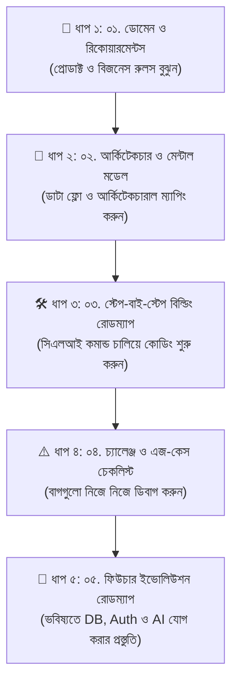

# EventPulse-Lite: নিজে প্রজেক্ট তৈরির সম্পূর্ণ হ্যান্ডবুক

অভিনন্দন! আপনি যদি HelpDesk-Lite প্রজেক্টের প্রতিটি কনসেপ্ট বুঝে থাকেন, তবে এবার সময় এসেছে নিজের মেধা ও চিন্তাশক্তি খাটিয়ে স্ক্র্যাচ থেকে একটি নতুন সিস্টেম তৈরি করার। 

প্রোগ্রামিং শেখার শ্রেষ্ঠ নিয়ম হলো: **টিউটোরিয়াল দেখে কোড করা ৩০%, আর নিজে নিজে একটি সিস্টেম ডিজাইন করে কোড লেখা ৭০%।**

আপনার জন্য যে প্রজেক্টটি ডিজাইন করা হয়েছে তার নাম: **`EventPulse-Lite`** (একটি আধুনিক টেক ইভেন্ট ও সিট বুকিং REST API)।

> 🛑 **এই গাইডের নিয়ম:** এই ডকুমেন্টগুলোতে আপনাকে কোনো তৈরি কোড (Copy-Paste Code) দেওয়া হয়নি! এখানে একজন সিনিয়র আর্কিটেক্টের মতো আপনাকে **প্রোডাক্টের রিকোয়ারমেন্ট, আর্কিটেকচারাল চিন্তাভাবনা, বিজনেস রুলস এবং ধাপে ধাপে কাজ সম্পন্ন করার রোডম্যাপ** দেওয়া হয়েছে। কোড লিখবেন আপনি নিজে!

---

## 🗺️ কীভাবে এই ডকুমেন্টগুলো পড়বেন এবং প্রজেক্ট তৈরি করবেন?

প্রজেক্টটি সফলভাবে সম্পন্ন করার জন্য নিচের ক্রমানুসারে ডকুমেন্টগুলো পড়ুন এবং বাস্তবায়ন করুন:

---

## 📑 ডকুমেন্টস সূচিপত্র ও সরাসরি লিংক

| ফাইল নম্বর ও লিংক | বিষয়বস্তু |
| :--- | :--- |
| **[০১. ডোমেন ও রিকোয়ারমেন্টস](./01-domain-and-requirements.md)** | `EventPulse-Lite` কী, কী কী রাউট থাকবে এবং কোন কোন কঠোর বিজনেস রুল মেনে চলতে হবে। |
| **[০২. আর্কিটেকচার ও মেন্টাল মডেল](./02-architecture-and-mental-model.md)** | মডিউল বাউন্ডারি, কন্ট্রোলার-সার্ভিস ভাগাভাগি, এবং কোন লেয়ারে কোন দায়িত্ব থাকবে। |
| **[০৩. স্টেপ-বাই-স্টেপ বিল্ডিং রোডম্যাপ](./03-step-by-step-building-roadmap.md)** | কাজ শুরুর প্রস্তুতি, প্রয়োজনীয় সিএলআই কমান্ড এবং ফেজ-বাই-ফেজ পোস্টম্যান টেস্ট নির্দেশিকা। |
| **[০৪. চ্যালেঞ্জ ও এজ-কেস চেকলিস্ট](./04-challenges-and-edge-cases.md)** | কোন কোন ফাঁদে আপনি পা দিতে পারেন (TypeScript ট্র্যাপ, 404 বনাম 400, পাইপ কনভার্সন)। |
| **[০৫. ফিউচার ইভোলিউশন রোডম্যাপ](./05-future-evolution-roadmap.md)** | প্রজেক্টটি শেষ করার পর কীভাবে ডাটাবেজ (Postgres), অথেন্টিকেশন (JWT) এবং এআই (AI Event Assistant) যুক্ত করবেন। |

---
⬅️ [পূর্ববর্তী টিউটোরিয়াল ডকস ফোল্ডারে ফিরে যান](../README.md)
