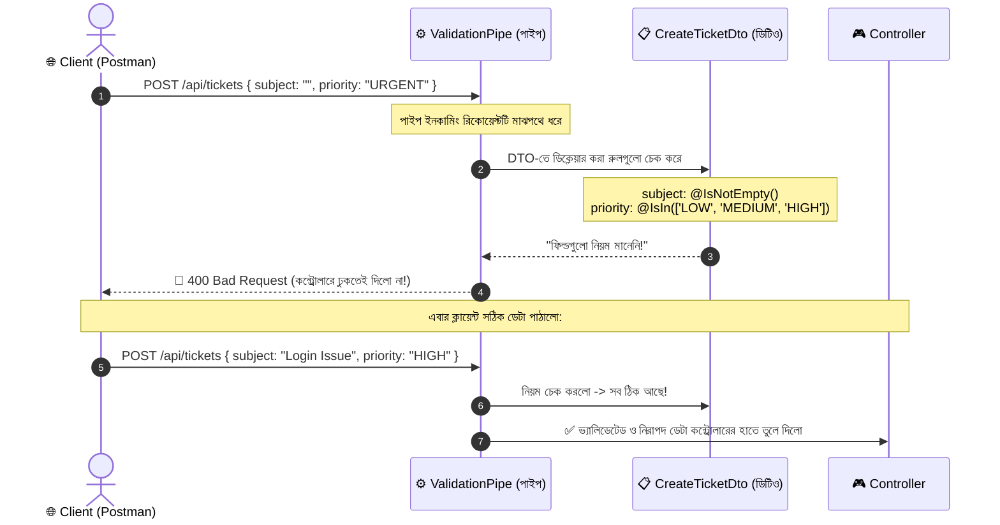

# DTO বনাম Pipe: বিশদ বাংলা গাইড

NestJS-এ নতুনদের কাছে সবচেয়ে বেশি বিভ্রান্তি তৈরি করে এই দুটি কনসেপ্ট: **DTO** এবং **Pipe**। 

এক লাইনে মূল পার্থক্য:
> **DTO হলো একটি "নকশা বা ফর্ম" (ডেটা কেমন দেখতে হবে তার নিয়ম), আর Pipe হলো সেই "অফিসার বা স্ক্যানার মেশিন" (যে ডেটা রূপান্তর ও যাচাই করার কাজটি বাস্তবে সম্পাদন করে)।**

---

## 📑 সূচিপত্র
1. [বাস্তব জীবনের অ্যানালজি (ফর্ম বনাম অফিসার)](#১-বাস্তব-জীবনের-অ্যানালজি-ফর্ম-বনাম-অফিসার)
2. [DTO কী, কেন, কখন এবং কীভাবে?](#২-dto-কী-কেন-কখন-এবং-কীভাবে)
3. [Pipe কী, কেন, কখন এবং কীভাবে?](#৩-pipe-কী-কেন-কখন-এবং-কীভাবে)
4. [এরা দুজন কীভাবে একসাথে কাজ করে?](#৪-এরা-দুজন-কীভাবে-একসাথে-কাজ-করে)
5. [তুলনামূলক টেবিল (Cheat Sheet)](#৫-তুলনামূলক-টেবিল-cheat-sheet)

---

## ১. বাস্তব জীবনের অ্যানালজি (ফর্ম বনাম অফিসার)

ধরে নিন আপনি বিমানবন্দরে সিকিউরিটি চেকের মধ্য দিয়ে যাচ্ছেন:

1. **DTO (Data Transfer Object) হলো আপনার পূরণ করা "কাস্টমস ডিক্লারেশন ফর্ম":**
   - ফর্মে কিছু ঘর আছে এবং নিয়ম লেখা আছে: "নাম লিখতে হবে", "পাসপোর্ট নম্বর ফাঁকা রাখা যাবে না", "ব্যাগে কোনো নিষিদ্ধ জিনিস থাকা যাবে না"।
   - **গুরুত্বপূর্ণ কথা:** ফর্মটি কিন্তু শুধুই একটি কাগজ। ফর্ম নিজে হেঁটে এসে আপনার হাত ধরতে পারে না বা আপনাকে বাধা দিতে পারে না!
   
2. **Pipe হলো "সিকিউরিটি অফিসার বা লাগেজ স্ক্যানার মেশিন":**
   - অফিসার আপনার পূরণ করা ফর্মটি হাতে নেয় এবং স্ক্যানার দিয়ে আপনার ব্যাগ ও তথ্য চেক করে।
   - ফর্মে যা যা নিয়ম লেখা আছে, বাস্তবে আপনি সেগুলো মেনেছেন কি না তা যাচাই করে।
   - কোনো অনিয়ম দেখলে অফিসারই আপনাকে **আটকে দেয় (Error ছুঁড়ে দেয়)**।
   - আবার কোনো ব্যাগে অতিরিক্ত অপ্রয়োজনীয় ট্যাগ থাকলে অফিসার সেটা কেটে **ঠিকঠাক সাইজ করে দেয় (Transform করে)**।

> 💡 **উপসংহার:** DTO ছাড়া Pipe জানে না কী চেক করতে হবে। আবার Pipe ছাড়া DTO শুধুই পড়ে থাকা একটি ক্লাস, কেউ তার নিয়ম বাস্তবে প্রয়োগ করার নেই!

---

## ২. DTO কী, কেন, কখন এবং কীভাবে?

### এটি কী?
DTO (Data Transfer Object) হলো একটি সাধারণ TypeScript `class`, যা ইনকামিং বা আউটগোয়িং ডেটার **গঠন (Shape/Structure)** কেমন হবে তা সংজ্ঞায়িত করে।

### এটি কী করে? (What it does)
- ইনকামিং রিকোয়েস্টে কোন কোন ফিল্ড থাকবে তা নির্ধারণ করে (যেমন: `subject`, `description`, `priority`)।
- ডেকোরেটরের মাধ্যমে নিয়ম লিখে রাখে (যেমন: `@IsNotEmpty()`, `@IsString()`, `@IsIn()`)।
- **নিজে কোনো কোড রান করে না; এটি শুধু মেটাডাটা ও টাইপ ধারণ করে।**

### কখন ও কেন ব্যবহার করবেন? (When & Why)
- **কখন:** যখনই ক্লায়েন্ট থেকে কোনো ডেটা গ্রহণ করবেন (`@Body()`, `@Query()`)।
- **কেন:** ক্লায়েন্ট যেন উল্টাপাল্টা অতিরিক্ত ফিল্ড পাঠাতে না পারে এবং ফ্রন্টএন্ড ও ব্যাকএন্ডের মধ্যে ডেটার চুক্তিপত্র শতভাগ পরিষ্কার থাকে।

### কীভাবে ব্যবহার করবেন? (How)
```typescript
// src/tickets/dto/create-ticket.dto.ts
import { IsNotEmpty, IsString, IsIn } from 'class-validator';

export class CreateTicketDto {
  @IsNotEmpty({ message: 'Subject খালি রাখা যাবে না।' })
  @IsString()
  subject: string;

  @IsNotEmpty({ message: 'Description দেওয়া আবশ্যক।' })
  @IsString()
  description: string;

  @IsIn(['LOW', 'MEDIUM', 'HIGH'], { message: 'Priority অবশ্যই LOW, MEDIUM অথবা HIGH হতে হবে।' })
  priority: 'LOW' | 'MEDIUM' | 'HIGH';
}
```

---

## ৩. Pipe কী, কেন, কখন এবং কীভাবে?

### এটি কী?
Pipe হলো একটি **ফাংশনাল প্রসেসর বা ইন্টারসেপ্টিং ফিল্টার** যা `PipeTransform` ইন্টারফেস মেনে চলে এবং রিকোয়েস্ট লাইফসাইকেলে কন্ট্রোলারে ঢোকার ঠিক মুখে বসে থাকে।

### এটি কী করে? (What it does)
Pipe মূলত দুটি প্রধান কাজ করে:
1. **Transformation (রূপান্তর):** ইনপুট ডেটাকে অন্য টাইপে কনভার্ট করে (যেমন: URL-এর স্ট্রিং `"10"` কে আসল সংখ্যা `10`-এ রূপান্তর করে `ParseIntPipe`)।
2. **Validation (যাচাইকরণ):** ইনপুট ডেটা DTO-এর নিয়মের সাথে মিলিয়ে দেখে। ভুল হলে রিকোয়েস্ট কন্ট্রোলারে ঢুকতেই দেয় না, তার আগেই **`400 Bad Request`** দিয়ে থামিয়ে দেয় (যেমন: `ValidationPipe`)।

### কখন ও কেন ব্যবহার করবেন? (When & Why)
- **কখন:**
  - URL প্যারামিটারকে স্ট্রিং থেকে নাম্বারে কনভার্ট করতে (`ParseIntPipe`)।
  - DTO-এর নিয়মগুলো প্রতিটি রিকোয়েস্টে কার্যকর করতে (`ValidationPipe`)।
- **কেন:** যেন কন্ট্রোলারের ভেতরে ম্যানুয়ালি `isNaN(id)` বা শত শত `if/else` লিখে ডেটা চেক করতে না হয়।

### কীভাবে ব্যবহার করবেন? (How)

#### ক) টাইপ কনভার্সনের জন্য (`ParseIntPipe`):
```typescript
// src/tickets/tickets.controller.ts
@Get(':id')
findOne(@Param('id', ParseIntPipe) id: number) {
  // ParseIntPipe ইনকামিং স্ট্রিং "1" কে আসল সংখ্যা 1 বানিয়ে কন্ট্রোলারে পাঠায়
  return this.ticketsService.findOne(id);
}
```

#### খ) DTO ভ্যালিডেশন কার্যকর করতে (`ValidationPipe`):
[src/main.ts](../src/main.ts)-এ:
```typescript
// src/main.ts
app.useGlobalPipes(
  new ValidationPipe({
    whitelist: true,            // DTO-তে নেই এমন ফিল্ড বাদ দেয়
    forbidNonWhitelisted: true, // অতিরিক্ত ফিল্ড পাঠালে 400 এরর দেয়
  }),
);
```

---

## ৪. এরা দুজন কীভাবে একসাথে কাজ করে?



---

## ৫. তুলনামূলক টেবিল (Cheat Sheet)

| বৈশিষ্ট্য | DTO (Data Transfer Object) | Pipe (পাইপ) |
| :--- | :--- | :--- |
| **মূল স্বরূপ** | এটি একটি **ডেটা কাঠামো / ব্লু-প্রিন্ট** (Class) | এটি একটি **একশন বা প্রসেসর** (Transformer & Validator) |
| **প্রধান কাজ** | ডেটার ফিল্ড ও নিয়ম ঘোষণা করা | ডেটা রূপান্তর করা এবং নিয়মগুলো বাস্তবে পরীক্ষা করা |
| **প্রকৃতি** | প্যাসিভ (নিজে কোনো কোড এক্সিকিউট করে না) | একটিভ (রিকোয়েস্ট আটকে দিতে পারে বা ডেটা বদলে দিতে পারে) |
| **বাস্তব উদাহরণ** | `CreateTicketDto`, `UpdateTicketDto` | `ParseIntPipe`, `ValidationPipe`, `ParseUUIDPipe` |
| **কোথায় বসে** | মেথডের প্যারামিটারের টাইপ হিসেবে (`dto: CreateTicketDto`) | মেথডের প্যারামিটারে বা গ্লোবালি (`@Param('id', ParseIntPipe)`) |

---
⬅️ [Tutorial Breakdown Master Index এ ফিরে যান](./tutorial-breakdown/README.md)
