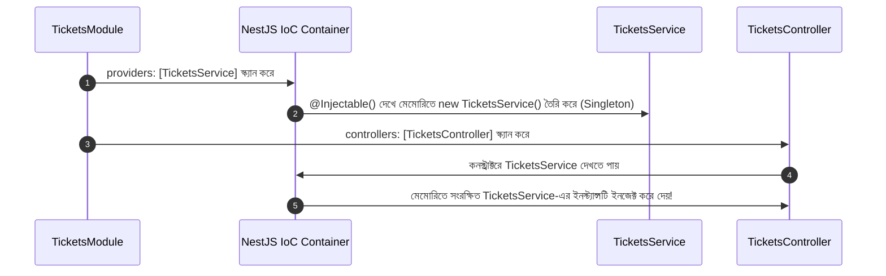

# ০৩. সার্ভিস ও ডিপেনডেন্সি ইনজেকশন (DI): The Wrong Way vs The Right Way

এই অধ্যায়ে আমরা শিখবো কেন কন্ট্রোলারে ডেটা বা বিজনেস লজিক রাখা মারাত্মক ভুল, এবং কেন ম্যানুয়ালি `new Service()` না লিখে NestJS-এর ডিপেনডেন্সি ইনজেকশন (DI) ব্যবহার করা আবশ্যক।

---

## ১. দায়িত্বের বিভাজন (Separation of Concerns)

আমরা চাইলে সব টিকিট ডেটা এবং লজিক সরাসরি কন্ট্রোলারের ভেতরেই লিখে ফেলতে পারতাম। অ্যাপ ছোট থাকলে তা কাজও করবে। কিন্তু ইঞ্জিনিয়ারিং দৃষ্টিকোণ থেকে এটি একটি মারাত্মক ব্যাড প্র্যাকটিস।

### কার কী কাজ?
- **Controller (ট্রাফিক পুলিশ):** ইনকামিং HTTP রিকোয়েস্ট রিসিভ করা, প্যারামিটার ও বডি চেক করা, এবং কাজ শেষ হলে ক্লায়েন্টকে রেসপন্স পাঠানো।
- **Service (কারিগর):** আসল ডেটা খুঁজে বের করা, ডেটাবেজ কুয়েরি চালানো, ভ্যালিডেশন চেক এবং বিজনেস লজিক নির্বাহ করা।

---

## ২. সার্ভিস তৈরি করা

টার্মিনালে কমান্ড:
```bash
nest g service tickets --no-spec
```

### পর্দায় কী ঘটলো?
1. `src/tickets/tickets.service.ts` তৈরি হলো `@Injectable()` ডেকোরেটর সহ।
2. [src/tickets/tickets.module.ts](../../src/tickets/tickets.module.ts)-এর `providers` অ্যারেতে `TicketsService` স্বয়ংক্রিয়ভাবে রেজিস্টার হয়ে গেল:
   ```typescript
   @Module({
     controllers: [TicketsController],
     providers: [TicketsService], // ⬅️ IoC কন্টেইনারে সার্ভিস রেজিস্টার হলো
   })
   export class TicketsModule {}
   ```

---

## ৩. ভুল পদ্ধতি (The Wrong Way): নিজে `new` করা

কন্ট্রোলারের সার্ভিসটি প্রয়োজন। একজন ডেভেলপার খুব সহজেই এভাবে লিখে ফেলতে পারেন:

```typescript
// ❌ ভুল পদ্ধতি (The Wrong Way)
@Controller('tickets')
export class TicketsController {
  // কন্ট্রোলার নিজেই সার্ভিসের ইনস্ট্যান্স তৈরি করছে!
  private readonly ticketsService = new TicketsService();

  @Get()
  findAll() {
    return this.ticketsService.findAll();
  }
}
```

### এটি কি কাজ করবে?
হ্যাঁ! পোস্টম্যানে কল দিলে আপনি একদম ঠিকঠাক ডেটা দেখতে পাবেন। **তাহলে এটিকে ভুল বলা হচ্ছে কেন?**

### ইঞ্জিনিয়ারিং সমস্যাগুলো:
1. **Tight Coupling (দৃঢ় বাঁধন):** কন্ট্রোলার নিজেই সার্ভিস তৈরির দায়িত্ব নিয়ে নিয়েছে। ভবিষ্যতে যদি সার্ভিসের কনস্ট্রাক্টরে কোনো ডেটাবেজ বা কনফিগ লাগে (`new TicketsService(database, logger)`), তবে কন্ট্রোলারেও কোড ভেঙে যাবে।
2. **Singleton নষ্ট হওয়া:** অ্যাপ্লিকেশনের ৩টি কন্ট্রোলার যদি এভাবে `new TicketsService()` লেখে, মেমোরিতে ৩টি আলাদা সার্ভিস অবজেক্ট তৈরি হবে। এক কন্ট্রোলার নতুন টিকিট যোগ করলে অন্য কন্ট্রোলার তা জানতেই পারবে না (ডেটা অসঙ্গতি)।
3. **টেস্টিং অসম্ভব হওয়া:** ইউনিট টেস্ট করার সময় আপনি কোনো ডামি বা মক সার্ভিস পাঠাতে পারবেন না।

---

## ৪. সঠিক পদ্ধতি (The Right Way): Constructor Injection

আমরা কন্ট্রোলারকে সার্ভিস তৈরি করার দায়িত্ব দেবো না। কন্ট্রোলার শুধু বলবে: *"আমার শুধু একটি TicketsService প্রয়োজন, কীভাবে বানাবে সেটা ফ্রেমওয়ার্কের বিষয়।"*

```typescript
// ✅ সঠিক পদ্ধতি (The Right Way)
@Controller('tickets')
export class TicketsController {
  // কনস্ট্রাক্টরে বাইরে থেকে সার্ভিস গ্রহণ করা হচ্ছে
  constructor(private readonly ticketsService: TicketsService) {}

  @Get()
  findAll() {
    return this.ticketsService.findAll();
  }
}
```

### TypeScript শর্টহ্যান্ডের ব্যাখ্যা:
কনস্ট্রাক্টরের ভেতরে `private readonly ticketsService: TicketsService` লিখে দিলেই TypeScript একসাথে তিনটি কাজ করে:
1. ক্লাসের ভেতর `ticketsService` নামে একটি প্রাইভেট ফিল্ড তৈরি করে।
2. কনস্ট্রাক্টরের প্যারামিটারে ইনকামিং অবজেক্ট রিসিভ করে।
3. `this.ticketsService = ticketsService` দিয়ে মানটি ক্লাসের ফিল্ডে স্বয়ংক্রিয়ভাবে বসিয়ে দেয়।

---

## ৫. ডিপেনডেন্সি ইনজেকশন (DI) কীভাবে কাজ করে?



- বাইরে থেকে দেখলে Postman-এ রেসপন্স একই থাকে।
- কিন্তু ভেতরের আর্কিটেকচার এখন শতভাগ মডুলার, মেমোরি-সাশ্রয়ী এবং টেস্ট-ফ্রেন্ডলি।

---
⬅️ [পূর্ববর্তী অধ্যায়: ০২. মডিউল, কন্ট্রোলার ও CLI ফিলোসফি](./02-module-controller-and-cli.md) | ➡️ [পরবর্তী অধ্যায়: ০৪. টাইপ কন্ট্রাক্ট ও ডাইনামিক রাউটস](./04-interface-and-pipes.md)
