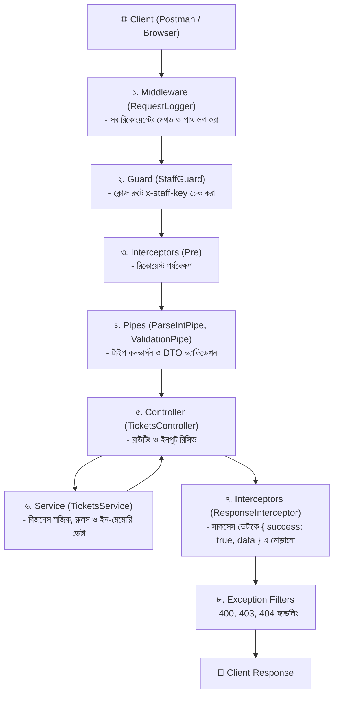

# হেল্পডেস্ক-লাইট: NestJS ও সফটওয়্যার ইঞ্জিনিয়ারিং মাইন্ডসেট গাইড

এই গাইড সিরিজটি [Learn with Sumit](https://youtube.com/@learnwithsumit)-এর **HelpDesk-Lite** টিউটোরিয়ালের সম্পূর্ণ ইঞ্জিনিয়ারিং ব্রেকডাউন। এখানে প্রতিটি আর্কিটেকচারাল সিদ্ধান্ত, কেন এক্সপ্রেসের চেয়ে নেস্টজেএস আলাদা, কীভাবে বড় সিস্টেম ডিজাইন করতে হয়, এবং লাইভ ডেপ্লয়মেন্ট পর্যন্ত প্রতিটি ধাপ নিখুঁত ও সহজ বাংলায় ব্যাখ্যা করা হয়েছে।

---

## 🧭 সম্পূর্ণ অ্যাপ্লিকেশন আর্কিটেকচার ম্যাপ

---

## 📚 ধারাবাহিক ১০টি পাঠের সূচিপত্র

প্রতিটি অধ্যায় ধাপে ধাপে পড়ার জন্য নিচের লিংকে ক্লিক করুন:

| পাঠ নম্বর ও লিংক | মূল বিষয়বস্তু ও ইঞ্জিনিয়ারিং ভাবনা |
| :--- | :--- |
| **[০১. মাইন্ডসেট ও প্রজেক্ট সেটআপ](./01-mindset-and-setup.md)** | এক্সপ্রেস বনাম নেস্টজেএস, প্রজেক্ট স্কোপিং, ES Modules এবং বয়লারপ্লেট ক্লিনআপ। |
| **[০২. মডিউল, কন্ট্রোলার ও CLI ফিলোসফি](./02-module-controller-and-cli.md)** | সিএলআই কমান্ডের রহস্য (`--no-spec --flat`), গ্লোবাল প্রিফিক্স এবং প্রথম এন্ডপয়েন্ট। |
| **[০৩. সার্ভিস ও ডিপেনডেন্সি ইনজেকশন (DI)](./03-service-and-dependency-injection.md)** | কন্ট্রোলারের পরিধি, ম্যানুয়াল `new` কেন ক্ষতিকর (The Wrong Way) এবং Constructor Injection (The Right Way)। |
| **[০৪. টাইপ কন্ট্রাক্ট ও ডাইনামিক রাউটস](./04-interface-and-pipes.md)** | ইন্টারফেস, ডাইনামিক রুট `@Param('id')`, রানটাইম স্ট্রিং বনাম টাইপস্ক্রিপ্ট টাইপ এবং `ParseIntPipe`। |
| **[০৫. এক্সেপশন ও কোয়েরি ফিল্টারিং](./05-exceptions-and-query-filtering.md)** | `NotFoundException`, অপশনাল `@Query()`, ফিল্টারিং এবং অদ্ভুত "ব্যানানা প্রবলেম"। |
| **[০৬. DTO ও ভ্যালিডেশন পাইপলাইন](./06-dto-and-validation-pipeline.md)** | Type Erasure, `class-validator`, `whitelist` বনাম `forbidNonWhitelisted` এর কঠোর নিরাপত্তা। |
| **[০৭. ইনফ্রাস্ট্রাকচার ও পাবলিক ডেপ্লয়মেন্ট](./07-infrastructure-and-deployment.md)** | লোকালহোস্ট বনাম প্রোডাকশন সার্ভার, `dist/main.js`, `process.env.PORT` এবং ইন-মেমোরি ডাটার সীমাবদ্ধতা। |
| **[০৮. PATCH আপডেট ও বিজনেস লজিক](./08-patch-update-and-business-rules.md)** | PUT বনাম PATCH, `tsconfig.json`-এর `useDefineForClassFields` ট্র্যাপ এবং সার্ভিস লেয়ারের বিজনেস রুল। |
| **[০৯. ডোমেন অ্যাকশন, মিডলওয়্যার ও গার্ড](./09-domain-actions-middleware-and-guards.md)** | ডেডিকেটেড ক্লোজ অ্যাকশন, `RequestLoggerMiddleware`, এবং `StaffGuard`-এর সঙ্গে `ExecutionContext`। |
| **[১০. ইন্টারসেপ্টর ও ফাইনাল রি-ডেপ্লয়মেন্ট](./10-interceptors-and-final-deployment.md)** | গ্লোবাল `ResponseInterceptor`, RxJS `next.handle()`, এরর বাউন্ডারি এবং ফাইনাল লাইভ ভেরিফিকেশন। |
| **[⭐ DTO বনাম Pipe এর বিশদ তুলনা](../pipe-vs-dto-guide.md)** | বাস্তব জীবনের উপমাসহ DTO এবং Pipe-এর পার্থক্য, কখন কোনটা কেন কীভাবে কাজ করে। |

---
⬅️ [প্রজেক্ট ডকস ফোল্ডারে ফিরে যান](../README.md)
